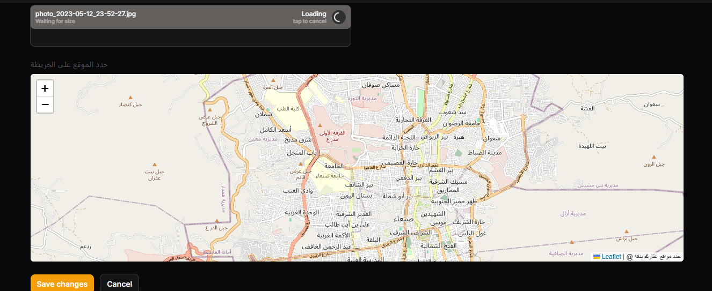

# 🏠 Real Estate Platform - Laravel + Livewire + Filament

نظام عقاري احترافي مبني باستخدام Laravel 10 وLivewire وFilament Admin، يمكّن المستخدمين من تأجير أو بيع العقارات مع واجهات جذابة ودعم للخرائط والصور، وصلاحيات مخصصة لكل من المالك والمستأجر والإدارة.

---

## 🚀 الميزات الرئيسية

- 🔑 تسجيل دخول مخصص (مالك، مستأجر، زائر)
- 🏠 إضافة وتصفح العقارات (شقق، فلل، محلات، مباني)
- 🗺️ تحديد الموقع من خلال الخريطة (Leaflet.js)
- 📸 رفع صور للعقار مع عرض سلايدر جذّاب
- 🗃️ لوحة إدارة متقدمة باستخدام Filament
- 🔎 فلاتر وتصنيفات حسب المدينة، المنطقة، النوع، السعر
- 💳 دعم الدفع الإلكتروني (Stripe)
- 📊 تقارير وعدادات للإدارة والمالكين

---

## 🖼️ صور من الواجهة

### 🎯  Admin قائمة العقارات الخاص ب :

![Property Listing Screenshot]
(screenshots/property-listing.png)

### 📍 تحديد الموقع على الخريطة:



### 🖼️  تفاصيل العقار:

.png)
### 🖼️  تفاصيل العقار: responsive on the phone

.png)

---
---

## ⚙️ التثبيت

```bash
git clone https://github.com/username/real-estate-platform.git
cd real-estate-platform

composer install
cp .env.example .env
php artisan key:generate

# إعداد قاعدة البيانات
php artisan migrate --seed

# إعداد روابط التخزين
php artisan storage:link

# تثبيت npm (لـ Livewire / Filament)
npm install && npm run build
```

---

## 👤 أنواع المستخدمين

| النوع       | صلاحيات                                                |
|-------------|---------------------------------------------------------|
| 🔑 Admin    | إدارة كافة العقارات والمستخدمين والتقارير             |
| 🏠 Owner    | إضافة عقارات، متابعة الحجزات، الرد على المستأجرين     |
| 👤 Tenant   | تصفح، حجز، وطلب معلومات عن العقارات                   |

---

## 🌍 نظام الخرائط

- يعتمد على [Leaflet.js](https://leafletjs.com) مفتوح المصدر.
- يتم تحديد إحداثيات العقار يدويًا عبر اختيار الموقع من الخريطة.
- تُحفظ الإحداثيات تلقائيًا داخل قاعدة البيانات.

---

## 📦 المتطلبات

- PHP >= 8.1
- Laravel >= 10.x
- MySQL أو PostgreSQL
- Node.js >= 16
- Composer

---

## 📄 الرخصة

هذا المشروع مرخص تحت [MIT License](LICENSE).
